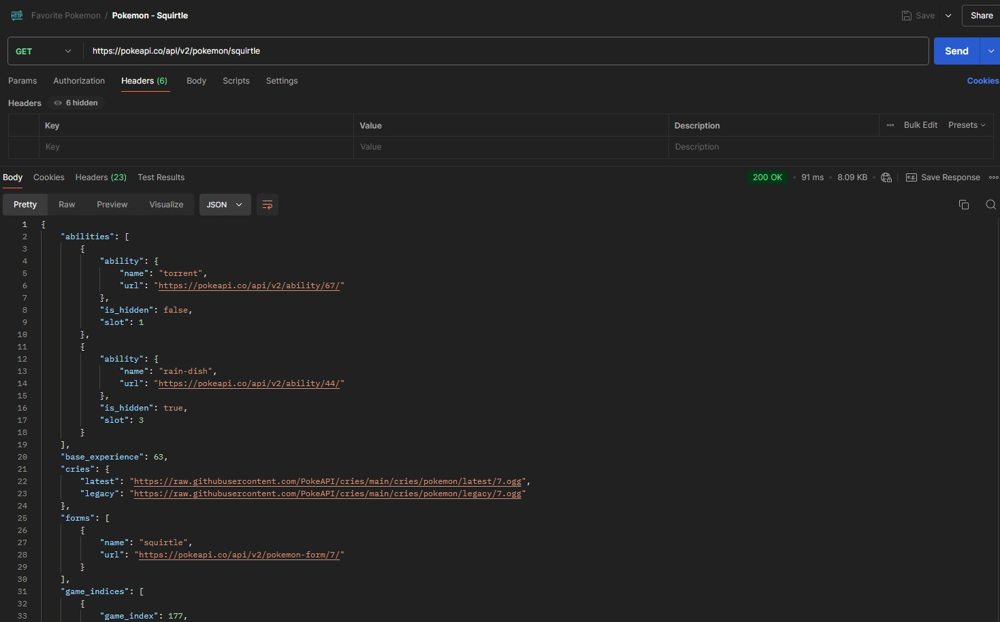
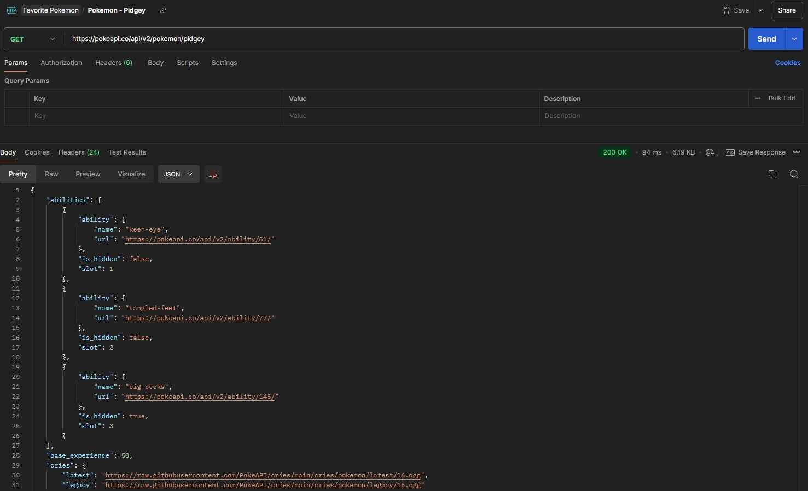
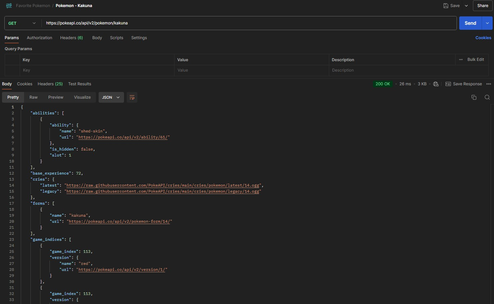
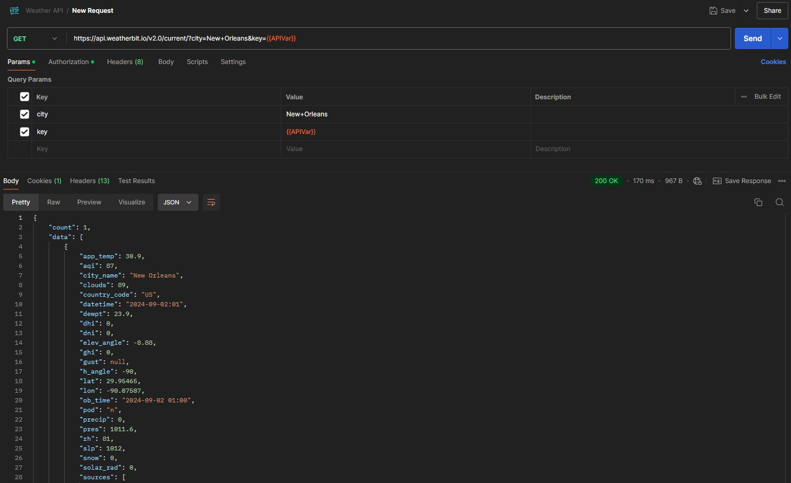

# postman-reflection

## Day 1 - Pokemon gets

### Squirtle

  

  * Name: Squirtle
  * Request URL: https://pokeapi.co/api/v2/pokemon/squirtle
  * Request was successful and returned a code 200
  * Returned characteristics such as: abilities, base experience, height
  
  ### Pidgey

  

  * Name: Pidgey
  * Request URL: https://pokeapi.co/api/v2/pokemon/pidgey
  * Request was successful and returned a code 200
  * Returned characteristics such as: abilities, base experience, height

  ### Kahuna

  

  * Name: Kahuna
  * Request URL: https://pokeapi.co/api/v2/pokemon/kakuna
  * Request was successful and returned a code 200
  * Returned characteristics such as: abilities, base experience, height

## Day 2 - Weather API

  * URL = https://api.weatherbit.io/v2.0/current/?city=New+Orleans&key={{APIVar}}
  * Parameters: City and Authorization key
  * Request was successful with expected weather related details.

    
    

Postman query parameters are specific to the API with strong adherence to syntax.