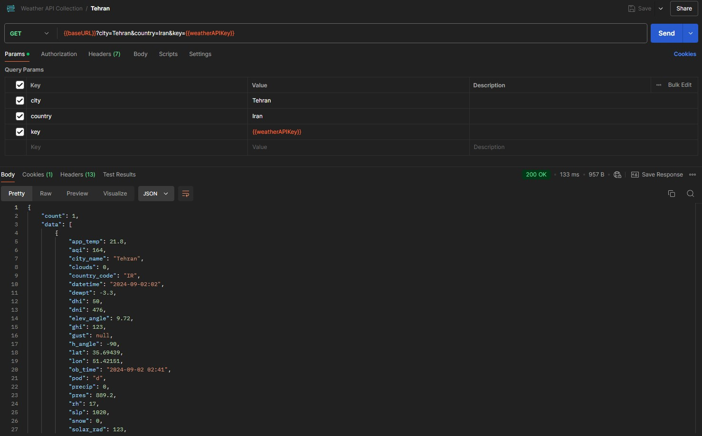
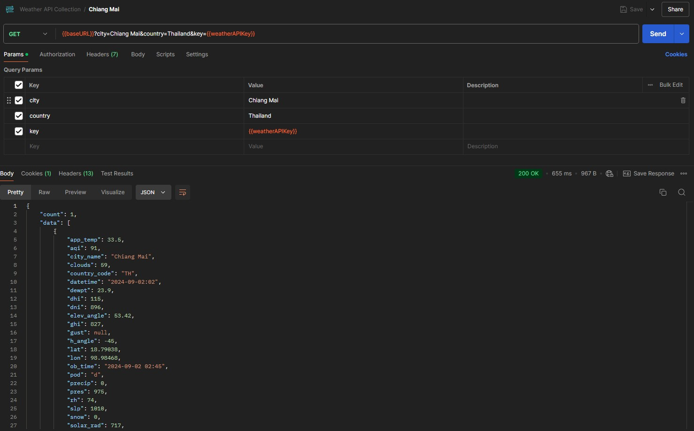
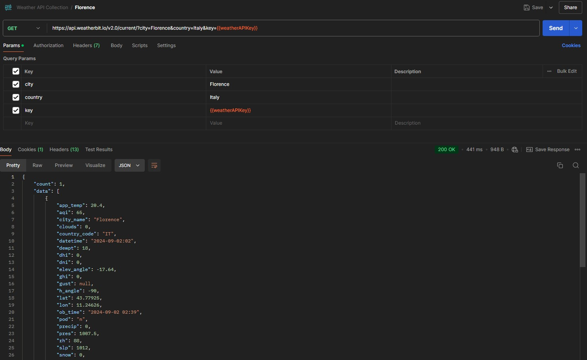
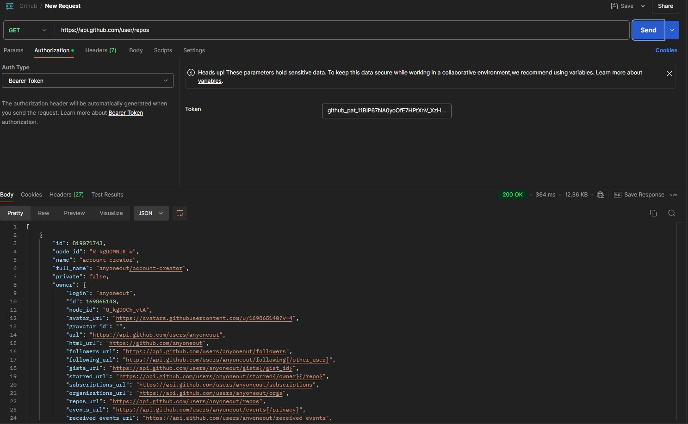
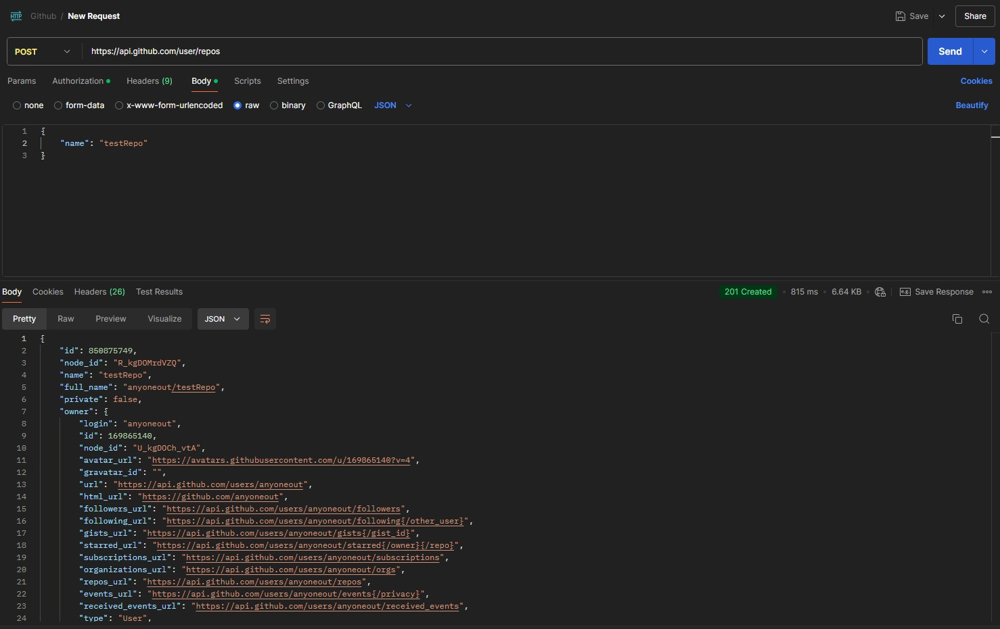
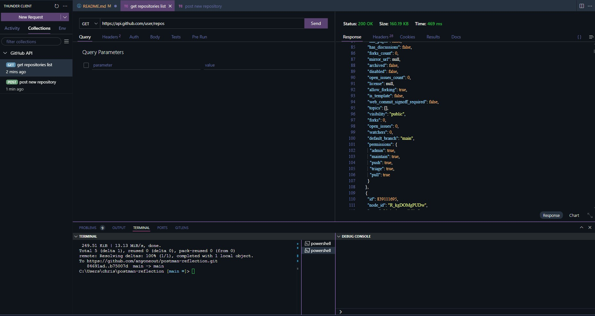
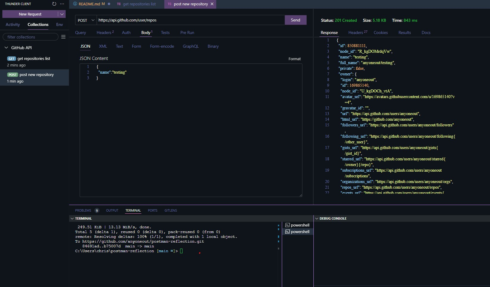

# postman-reflection

## Day 1 - Introduction to APIs

### Squirtle

  

  * Name: Squirtle
  * Request URL: https://pokeapi.co/api/v2/pokemon/squirtle
  * Request was successful and returned a code 200
  * Returned characteristics such as: abilities, base experience, height
  

  ### Pidgey

  

  * Name: Pidgey
  * Request URL: https://pokeapi.co/api/v2/pokemon/pidgey
  * Request was successful and returned a code 200
  * Returned characteristics such as: abilities, base experience, height

  ### Kahuna

  

  * Name: Kahuna
  * Request URL: https://pokeapi.co/api/v2/pokemon/kakuna
  * Request was successful and returned a code 200
  * Returned characteristics such as: abilities, base experience, height

## Day 2 - Exploring the Weather API

  * URL = https://api.weatherbit.io/v2.0/current/?city=New+Orleans&key={{APIVar}}
  * Parameters: City and Authorization key
  * Request was successful with expected weather related details.

    
    

Postman query parameters are specific to the API with strong adherence to syntax.

## Day 3 API Collections (Optional)

Tehran, Iran

Chiang Mai, Thailand

Florence, Italy

A variable was created in the Weather API collection which was used as the key in all three calls. A second variable was created and used for the base url. Variable creation helps minimize redundant time-consuming inputting of static or rarely altered information. All gets were successful and returned pertinent weather data. 

## Day 4 - Interacting with GitHub repositories

### Get Repositories List

  * Create a new request
  * Select GET
  * Add URL ("https://api.github.com/user/repos")
  * No parameters necessary
  * Click Send

  

  ### Create Repo

  * Create a new request
  * select POST
  * Add URL ("https://api.github.com/user/repos")
  * Select "Body" from options
  * Select "raw" from radio button options
  * Select JSON from dropdown menu
  * Add {"name":"anytexthere"} to initialize new repo
  * Click Send

  

  ## Day 5 - Thunder Client (optional)

  * Thunder Client seems to have streamlined POSTMAN for VSCode users. Authorization is automatically inherited from the parent collection and JSON is the default setting when inputting parameters. Also, it seems to be faster than POSTMAN.

  

  